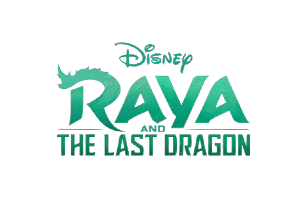
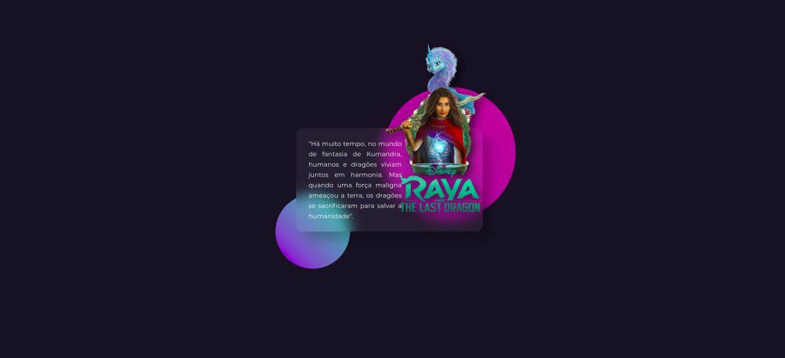

## Raya - O último dragão - by Gilles

<h1 align="center">
  <p align="center">
    
  </p>

  <h3 align="center">
  Simple page designed to train CSS and element positioning. 
  </h3>
  <p align="center">
     
      
      
      
  </p>
</h1>

<p align="center">
  <a href="#page_with_curl-sobre">About</a>&nbsp;&nbsp;&nbsp;|&nbsp;&nbsp;&nbsp;
  <a href="#books-requisitos">Requirements</a>&nbsp;&nbsp;&nbsp;|&nbsp;&nbsp;&nbsp;
  <a href="#rocket-começando">Starting</a>&nbsp;&nbsp;&nbsp;|&nbsp;&nbsp;&nbsp;
  <a href="#How_to_contribute">Contributors</a>&nbsp;&nbsp;&nbsp;|&nbsp;&nbsp;&nbsp;
  <a href="#author">Author</a>&nbsp;&nbsp;&nbsp;|&nbsp;&nbsp;&nbsp;
  <a href="#user-content-license">License</a>&nbsp;&nbsp;&nbsp;|&nbsp;&nbsp;&nbsp;
</p>

## :page_with_curl: About

It is a web page, developed to practice CSS, with over positions of elements, where the film Raya the last dragon was used as a theme.

**HTML**: The structure and classes were defined using HTML 5.

**CSS**: All styling and overlays were done with CSS.

## :books: Requirements

The following tools were used in the construction of the project:

- **[HTML](https://html.com/)**
- **[CSS](https://www.maujor.com/)**

## :rocket: 🎧🕹Starting

🚧

```bash
  # Clone the project:
  $ git clone https://github.com/Gilles30/raya-dragon-main

  # Enter Directory:
  $ cd raya-dragon-main

  #Enter the src folder
  $ cd src

  # Double-click on the index.html file
  $ index.html
```

## :computer: Preview

<p size=5>
  
</p>

---

## 👾 How_to_contribute

1. Fork the project.
2. Create a new branch with your changes: `git checkout -b my-feature`
3. Save your changes and create a confirmation message saying what you did: `git commit -m" feature: My new feature "`
4. Submit your changes: `git push origin my-feature`
   > If you have any questions, see this [guide on how to contribute](./CONTRIBUTING.md)

---

## License

This project is under license [MIT] (./ LICENSE).

Made with love by Lorison Gilles s2 (Feito com amor por Lorison Gilles) 👋🏽 [Get in Touch!](Https://www.linkedin.com/in/lorison-gilles/)

## 👨🏻‍🚀 About me 👨🏻‍🔬

<a href="https://www.linkedin.com/in/lorison-gilles/">
 
 <p>Lorison Gilles</p>

[](https://www.linkedin.com/in/lorison-gilles/)
[](mailto:lorison.gilles@gmail.com)

</a>
<br>

Made with love 💜 by [Lorison Gilles](https://github.com/Gilles30) 🖖🏻👾☕
